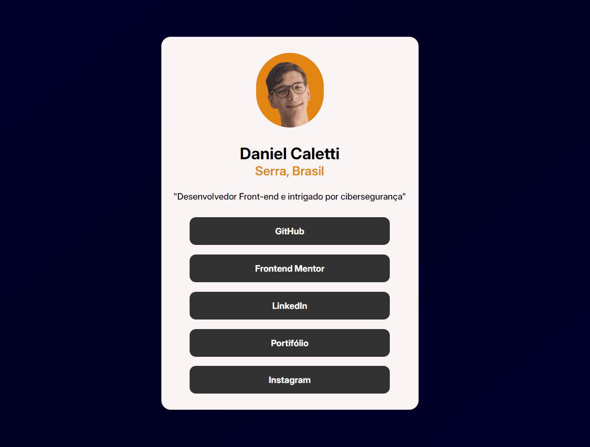
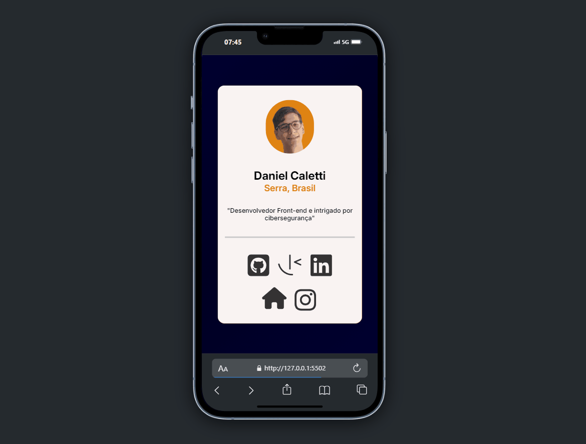

<span align="center">
      
# Portifólio Redes Sociais 🙂 
      
</span>

Olá, seja bem-vindo à minha primeira atividade do [**Frontend Mentor**](https://www.frontendmentor.io/challenges/social-links-profile-UG32l9m6dQ) na qual realizei a construção de um portfólio, utilizando as linguagens:

<br>

<span align="center">

 

</span>

---

<span align="center">

#### ✅ Projeto Finalizado ✅

</span>

### **Layout Desktop 💻**


### **Layout Mobile 📱**


---

<span align="center">
      
### **Novas Descobertas**

</span>

<div align="justify">

Para melhorar minhas habilidades e testar minha criatividade, participei de um desafio iniciante na plataforma. Durante o processo, explorei novas tecnologias, como as **@keyframes**, que permitem criar animações sem depender de JavaScript.

</div>

<span align="center">

### **Dificuldades Encontradas**

</span>

<div align="justify">

Mesmo se tratando de um desafio fácil, me deparei com alguns empecilhos em torno da responsividade da página (após finalizar minha primeira versão do site percebo que minha extensão até o momento utilizada para redimensionamento de telas o [**Responsive Viewer**](https://chromewebstore.google.com/detail/responsive-viewer/inmopeiepgfljkpkidclfgbgbmfcennb) havia colocado um zoom de 70% em meu navegador de forma com que não havia me atentado realizando toda a construção do mesmo para aquele determinado tamanho, desse modo me obrigando a refazer todo o site 🥲🤣).
</div>

---

### **Licenças**

Autorizo o uso deste código somente para fins educacionais. 😉

### **Clonagem**

```
git clone o-endereço-do-seu-projeto-no-github
```

---

### **Colaboradores**

<div align="justify">

Um agradecimento especial ao [**DevQuest**](https://www.youtube.com/@DevemDobro) que me proporcionou o conhecimento necessário para a construção deste portfólio, além do suporte com eventuais dúvidas de forma objetiva.

</div>

<br>

<div align="center">
      <a href="https://www.youtube.com/@DevemDobro">
        <br>
          <strong>DevQuest</strong>
      </a>
</div>